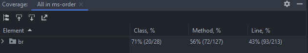
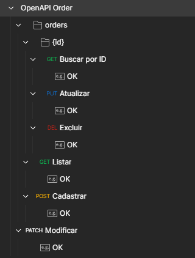
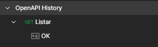

# MS Order


- URL: http://localhost:8081/api/orders
- [Swagger - openapi](./ms-order/src/main/resources/openapi.yaml)
- MySQL Workbench
- Kafka




## Exemplo de cURL

### POST - Cadastrar

`/orders`

```cURL
curl --location --request POST 'http://localhost:8081/api/orders' \
--header 'Content-Type: application/json' \
--header 'Accept: application/json' \
--data-raw '{
  "cpf": "04043674023",
  "items": [
    {
      "creationDate": "10-10-2025",
      "description": "este",
      "expirationDate": "11-10-2030",
      "name": "test",      
      "value": 11.50
    },
    {
      "creationDate": "03-10-2030",
      "description": "este",
      "expirationDate": "02-10-2045",
      "name": "second test",      
      "value": 13.50
    }
  ],
  "address": {
    "cep": "98700000",
    "numero": "233",
    "logradouro": "logradouro test",
    "bairro": "bairro test"
  }
}'
```

### GET - Listar

`/orders`

```cURL
curl --location --request GET 'http://localhost:8081/api/orders' \
--header 'Accept: application/json'
```

### GET - Exibir por id

`/orders/:id`

```cURL
curl --location --request GET 'http://localhost:8081/api/orders/1' \
--header 'Accept: application/json'
```

### DEL - Excluir

`/orders/:id`

```cURL
curl --location --request DELETE 'http://localhost:8081/api/orders/1' \
--header 'Accept: application/json'
```

### PUT - Atualizar

`/orders/:id`

```cURL
curl --location --request PUT 'http://localhost:8081/api/orders/1' \
--header 'Content-Type: application/json' \
--header 'Accept: application/json' \
--data-raw '{
  "cpf": "04043674023",
  "items": [
    {
      "creationDate": "10-10-2025",
      "description": "este",
      "expirationDate": "11-10-2030",
      "name": "asd",      
      "value": 1.50
    },
    {
      "creationDate": "03-10-2030",
      "description": "este",
      "expirationDate": "02-10-2045",
      "name": "asd teste",      
      "value": 13.50
    }
  ],
  "address": {
    "cep": "98700000",
    "numero": "243"
  }
}'
```

### PATCH - Atualizar

`/item/:id`

```cURL
curl --location --request PATCH 'http://localhost:8081/api/item/1' \
--header 'Content-Type: application/json' \
--header 'Accept: application/json' \
--data-raw '{
  "name": "dolor et commodo cupidatat laborum",
  "creationDate": "02-08-2025",
  "expirationDate": "03-10-2030",
  "value": 50.00,
  "description": "aute dolore occaecat Duis"
}'
```

# MS History


- URL: http://localhost:8082/api/history
- [Swagger - openapi](./ms-history/src/main/resources/openapi.yaml)
- MongoDB
- Kafka


## Exemplo de cURL

### GET - Exibir

`/history/`

```cURL
curl --location --request GET 'http://localhost:8082/api/history' \
--header 'Accept: application/json'
```
